# Cat's Eye
Neural network library written in C and Javascript

## Features
- Lightweight and minimalistic:
  - Header only
  - Just include catseye.h and write your model in c. There is nothing to install.
  - Small dependency & simple implementation
- Fast: [under construction]
  - OpenCL support (GPGPU)
  - SSE, AVX support (But gcc and clang support SIMD...)
  - OpenMP support
  - Support half precision floats (16bit)
- Support Deep Learning:
  - Multilayer perceptron (MLP)
  - Deep Neural Networks (DNN)
  - Convolutional Neural Networks (CNN)
  - Generative Adversarial Network (GAN)
  - Network in Network (NIN)
- Supported networks:
  - Activation functions
    - sigmoid
    - softmax
    - tanh, scaled tanh (1.7519 * tanh(2/3x))
    - ReLU, Leaky ReLU, ELU, RReLU
    - abs
    - identity
  - Loss functions
    - cross-entropy, mean-squared-error
  - Optimization algorithms
    - stochastic gradient descent (with/without L2 normalization and momentum)
    - AdaGrad
    - RMSProp
  - Layer types
    - convolution
    - max pooling
    - average pooling
    - batch normalization
    - Sub-Pixel Convolution (Pixel Shuffler) [Upscaling or Deconvolution]
    - linear
    - CCCP, Cascaded Cross Channel Parametric Pooling
- Loader formats:
  - PNG
  - cifar [https://www.cs.toronto.edu/~kriz/cifar.html]
  - MNIST

## Usage
Just include header files in your project.

for more information, see example/

	$ cd example
	$ make
	$ ./sin

## Demo
- Recognizing handwritten digits by MNIST training ([example/mnist_train.c](example/mnist_train.c))
  - http://yui0.github.io/catseye/example/html/mnist.html

- Recognizing pictures ([example/cifar10_train.c](example/cifar10_train.c))
  - http://yui0.github.io/catseye/example/html/cifar10.html

- Neural Network 'paints' an image ([example/paint.c](example/paint.c))

  
  

  
  

  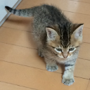
  

- Function approximation ([example/sin.c](example/sin.c))

  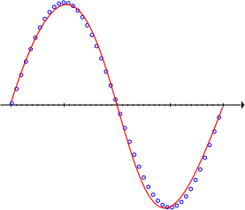
  

- Convolution Autoencoder ([example-new/mnist_autoencoder.c](example-new/mnist_autoencoder.c),[example-new/cifar_autoencoder.c](example-new/cifar_autoencoder.c))

  
  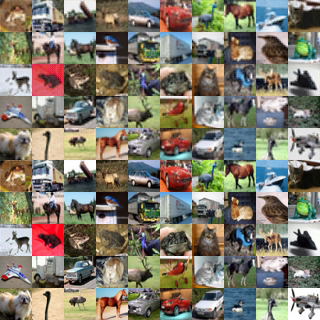

- DCGAN ([example-new/mnist_lsgan.c](example-new/mnist_lsgan.c))
  - epoch 1900

  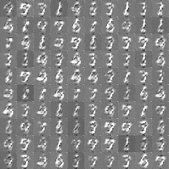

- Autoencoder ([example/mnist_autoencoder.c](example/mnist_autoencoder.c))
  - Unit 64 [tied weight]

  
  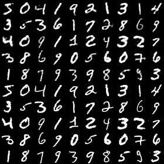
  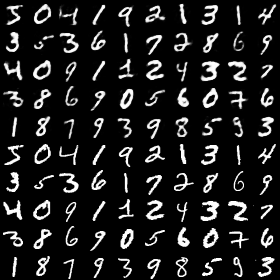

  
  
  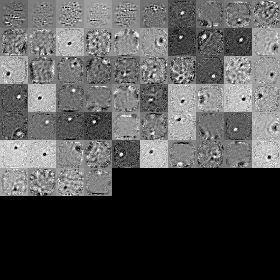

  - Unit 64

  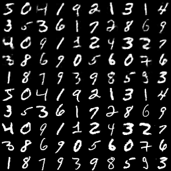
  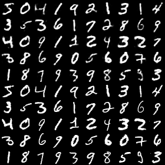
  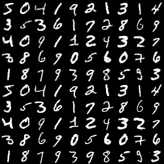

  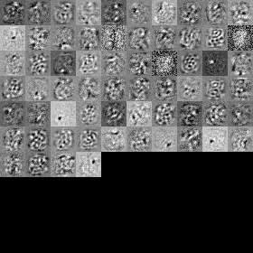
  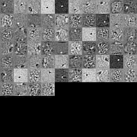
  

  - Unit 16

  
  
  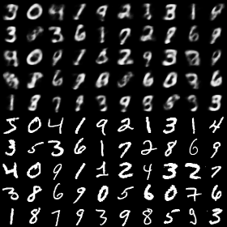

- Denoising Autoencoder
  - Unit 64

  
  

- Convolutional Neural Networks (example/mnist_cnn_train.c)
  - tanh, 7x7, 32ch, 99.2%

  

## Refrence
- Documents
  - Neural Networks and Deep Learning [http://nnadl-ja.github.io/nnadl_site_ja/chap1.html]
  - Machine learning [http://hokuts.com/category/%E3%83%97%E3%83%AD%E3%82%B0%E3%83%A9%E3%83%A0/%E6%A9%9F%E6%A2%B0%E5%AD%A6%E7%BF%92/]
  - CS231n Convolutional Neural Networks for Visual Recognition [http://cs231n.github.io/neural-networks-3/#anneal]
  - SVM [http://d.hatena.ne.jp/echizen_tm/20110627/1309188711]
  - Hello Autoencoder [http://kiyukuta.github.io/2013/08/20/hello_autoencoder.html]
  - Autoencoder [http://pc.atsuhiro-me.net/entry/2015/08/18/003402]
  - Autoencoder [http://www.slideshare.net/at_grandpa/chapter5-50042838]
  - Convolutional Neural Networks [http://blog.yusugomori.com/post/129688163130/%E6%95%B0%E5%BC%8F%E3%81%A7%E6%9B%B8%E3%81%8D%E4%B8%8B%E3%81%99-convolutional-neural-networks-cnn]
  - tiny-cnn [https://github.com/nyanp/tiny-cnn/wiki/%E5%AE%9F%E8%A3%85%E3%83%8E%E3%83%BC%E3%83%88]
  - Backpropagation [http://postd.cc/2015-08-backprop/]
  - Perceptron [http://tkengo.github.io/blog/2015/08/21/visual-perceptron/]
- Programing
  - Multilayer perceptron [http://kivantium.hateblo.jp/entry/2014/12/22/004640]
  - Weather example [http://arakilab.media.eng.hokudai.ac.jp/~t_ogawa/wiki/index.php?LibSVM]
  - Recognizing handwritten digits [http://aidiary.hatenablog.com/entry/20140201/1391218771]
  - Recognizing handwritten digits on Web [http://d.hatena.ne.jp/sugyan/20151124/1448292129]
  - Image generator by Denoising Autoencoder [http://joisino.hatenablog.com/entry/2015/09/09/224157]
  - Neural Network 'paints' an image [http://cs.stanford.edu/people/karpathy/convnetjs/demo/image_regression.html]
